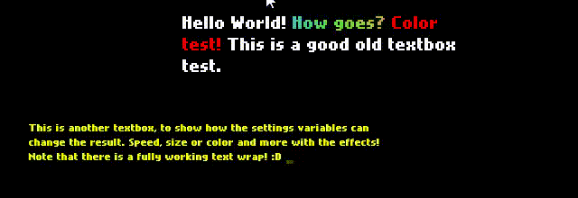

# A Haxeflixel unnamed textbox library
**NOTE** : Even though the API shouldn't change a lot for now, this project is still a bit in WIP.




## Features
- "Character-per-character"-style textbox for [Haxeflixel](https://haxeflixel.com/).
- Correct word-wrapping : a being written word won't jump from a line to another if it's too big for the current line
- Per-character effects : allows you to have dynamic text.
- Extendable and customizable : There is a way to add new effects to your textbox, change the font, color, size, etc...


## Usage

### Known issues or quirks
- On HTML5 we have to deal with an incorrect dimension report for space characters, thus letter spacing and space size are incorrect. Thus there is a magic cookie used in TextboxLine (search for "magic cookie") that should be tweaked to fit your preferences.

### Installation
Include the library's root folder as classpath in your project node. Something like (as 2018-04-16)
```xml
<project>
  <!-- Here goes some of your configuration -->
  <classpath name="path to the library's folder." />
  <!-- Here goes some of your configuration -->
```

Now you should be ready and able to require classes such as `textbox.Textbox`.

### Textbox functions
- `new (Float, Float, Settings)` : Creates a textbox where top-left corner is placed in (X,Y). Additional settings are stored in the given Settings object.
- `bring ()` : activates the textbox and its process, making it appear in-game.
- `dismiss ()` : deactivates the textbox and makes it disappear in-game
- `setText (String)` : parses the string's content and prepares itself for the next use.
- `continueWriting ()` : if the textbox is full, this function acknowledges it and asks the textbox to continue writing text (by moving up the text and writing in the newly empty last line)

### Callbacks
**NOTE** : This is under WIP as it might change between versions.

#### Why callbacks?
Callbacks are useful as they allow you to extend the textbox without touching its logic. It allowed me to extract the textbox's logic from my now-dead project and make it easy to add features over it, features like effects, triggering a sound per character added to the box or change how it deals with the siutation when the textbox is full.

A few callback ideas (chaining boxes, sound-per-character, text character) are shown in the given sample project.

- `statusChangeCallbacks (Status)` : if the textbox's state changes, this callback is called. Here a list of the expected behavior to be notifed of:
  + `FULL` : the textbox is full. Coupled with `continueWriting` you can make stuff like waiting a button press to resume writing.
  + `DONE` : the textbox finished writing its content. You can `dismiss` it or set it with new text.
- `characterDisplayCallbacks (textbox.Text)` : This callback is added each time a character is added to the box. Use this if you need features like an audio sample played for every character, a text cursor following the input, etc etc...

Those textbox callback facilities are just callback arrays, to add or remove your own callback, just use `push` or `pop` on those members.

### Settings object
(Check for textbox/Settings.hx to see what kind of parametters you can override.)
```haxe
  font:String             // Font location, default = HXFlixel's default font
  fontSize:Int            // default = 12
  textFieldWidth:Float    // default = 240px
  color:FlxColor          // default = White
  numLines:Int            // How many lines the textbox will display, default = 3
  charactersPerSecond:Int // default = 24
```

## Text effects
This textbox allows for per-character effects such as (but not limited to) rotating characters or making them wave, coloring text or making an animated rainbow. Those effects are enabled and disabled by in-text code sequences that are small and human-writable. The system that links effects and the textbox is also user-editable to add new effects for your own projects.

## Code sequences and effects.

### Usage example

```haxe
var textbox:Textbox = new Textbox(...);
textbox`.setText("
I'm enabling effect n°00 with arguments (0x00, 0x00, 0x00) : @001000000
I'm disabling effect n°05  @050
I'm enabling multiple effects : @0010A0C0E@0510DCCDE...
It even works inside wo@001000000rds, even if it's a bit unreadable...
");
```

### Enabling an effect
```
    @MM1AABBCC
    ▲│  │ │ │
    └┼Sequence start ()
     │  │ │ │
     └ Effect n° 0xMM
        │ │ │
        │ │ │
        └ Argument 1 : 0xAA
          │ │
          └ Argument 2 : 0xAA
            │
            └ Argument 3 : 0xAA
```

### Disabling an effect

```
    @MM0
    ▲│
    └┼Sequence start ()
     │
     └ Effect n° 0xMM
```

Note : The `0` or `1` between the effect index and the first argument indicates the textbox parser to disable or enable said effect

### Create new effects
**NOTE** : This is under WIP as it might change between versions.

To add an effect to the effect list, you have to create a class implementing `IEffect` and add it to `TextEffectArray`'s `effectClasses` variables. Two effects currently are already implemented : coloring some text and an animated rainbow effect. The effect's position index in the array will be it's code sequence's ID.

#### Effect interface
- `reset(Int, Int, Int, nthCharacter:Int):Void` : called when the effect is enabled on a character. (It's named reset as an effect can be set multiple times.)
- `update(Float)` : the good old classic update function, called by the textbox on a `FlxState.update()` tick or manual update.
- `apply(Float)` : called on a character's own update function to update the character's look if needed.
- `setActive(Bool)/isActive():Bool` : **(WIP)** implement those to correctly manage the effect's activated's state. A simple get/set is enough.

## Roadmap
The library's pretty much functionnal and gives the barebones features as now (the current effects comes from my dead project as freebies). Here's a non-exhaustive list of what could be added or changed to make the users' life easier :
- [ ] Change the callback types into arrays or a class that acts a bit like C#'s delegates.
- [ ] On JS, there is a quirk on how to calculate a space's width and a magic cookie is used instead. Maybe make this variable part of the settings class.
- [ ] Implement helper classes such as a status icon or a "Press a button to continue" helper class.
- [ ] Add more effects
- [ ] Add more examples
  + [ ] For tween-based character, factorize tween selection code?
- [ ] Document the code as well as this file?
- [ ] Unit testing. (As of now I've been using my own project and the sample as testing content but formalized unit testing would be nice to have)
